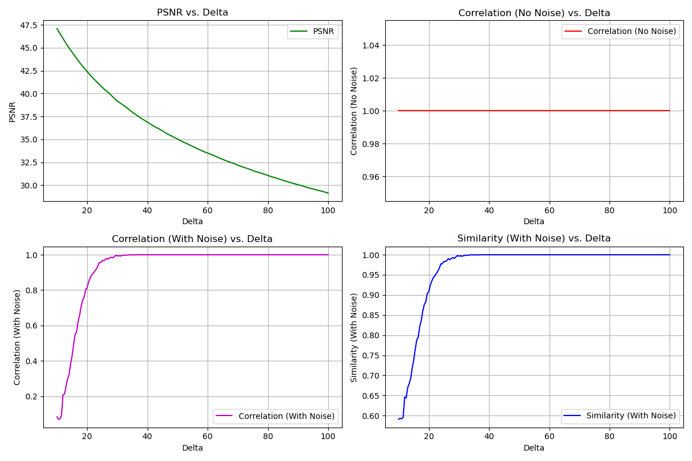
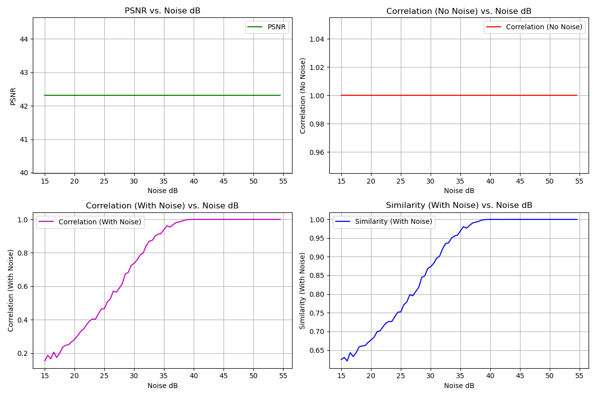

# PyQIM


|  | |
|:-----------------------------------------------:|:-----------------------------------------------:|
| Vanilla QIM with Different Quantificate Step Size | Adaptive QIM with Different Noise Level |

PyQIM is a Python library for Quantization Index Modulation (QIM) based watermarking. It provides functionalities to embed and extract watermarks in grayscale images using Discrete Cosine Transform (DCT).

## Features

- Embed watermarks into grayscale images.
- Extract watermarks from watermarked images.
- Evaluate the similarity between the original and extracted watermarks.
- Visualize the original, watermarked, and extracted images.

## Installation

To create a conda environment with the required dependencies, run:

```bash
conda env create -f environment.yml
```

To activate the environment, use:

```bash
conda activate stego
```

To see the embedding and extraction process, run the `TESTQIM.py` script:
```bash
cd PyQIM
python -m examples.TestQIM
```

## Usage

### Embedding a Watermark

```python
import cv2
from qim.QIMHide import QIMHide
from qim.utils.Plot import plot_images

# Load images
carrier_path = 'path/to/carrier_image.bmp'
watermark_path = 'path/to/watermark_image.bmp'
I = cv2.imread(carrier_path, cv2.IMREAD_GRAYSCALE)
d = cv2.imread(watermark_path, cv2.IMREAD_GRAYSCALE)
data = d.flatten()

# Embed watermark
delta = 25.5
stg = QIMHide(I, data, delta)

# Plot images
imgs = {"Original": I, "Watermarked": stg}
plot_images(imgs)
```

### Extracting a Watermark

```python
from qim.QIMDehide import QIMDehide
from qim.utils.Similar import Similar
from qim.utils.Plot import plot_images

# Extract watermark
msg = QIMDehide(stg, delta, len(data))
m = msg.reshape(d.shape)
s = Similar(d, m)

# Plot images
imgs = {"Original Watermark": d, "Extracted Watermark": m, "Difference": np.bitwise_xor(d, m)}
plot_images(imgs)
```

## Contributing

Contributions are welcome! Please open an issue or submit a pull request.

## License

This project is licensed under the MIT License.